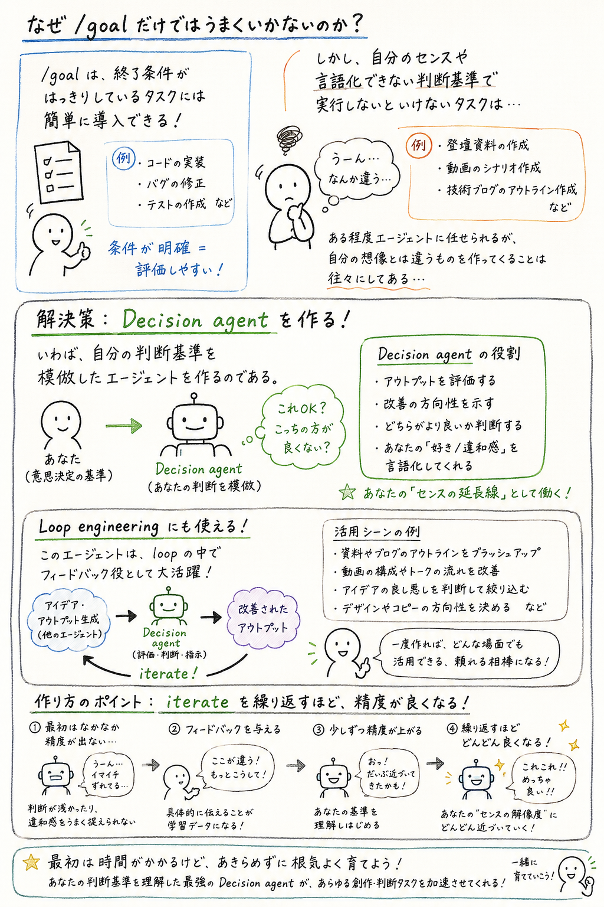

# Decision Agent Specification



## Purpose

Decision Agent imitates a user's judgment criteria for tasks where the success
condition is subjective or hard to describe up front.

Goal-like automation works well for programming tasks because completion can often
be checked with tests, builds, or explicit acceptance criteria. It works less well
for creative or taste-driven work such as:

- talk deck outlines
- video scripts
- technical blog outlines
- titles, positioning, and narrative structure
- agent-generated artifacts that need a user's personal review

In these cases, an agent can produce something plausible but still different from
what the user imagined. Decision Agent is intended to close that gap by learning
how the user judges outputs over repeated iterations.

The central responsibility is judgment, not generation.

## Philosophy

### A model of the user, not a generic filter

Decision Agent's target is not "is this artifact good," but "how closely does
this match the judgment this specific user would have made." A gatekeeper
that blocks bad output is a useful side effect, not the goal. The goal is
fidelity: Decision Agent is a model of one person's judgment criteria, built
and refined from that person's own decisions.

This is a fidelity target, not an identity claim. Decision Agent does not
become the user or decide on the user's behalf; it predicts what the user
would decide, stays inspectable about why, and is explicitly allowed to be
wrong. "Predicts how the user would respond" (see Core Concept) is the
honest framing this philosophy commits to — "acts as the user" is not.
Verdicts, issues, and revision instructions are always framed as a
prediction of the user's judgment, never as the user's actual decision.

### An opinion, not an echo

When Decision Agent's judgment and the user's actual judgment diverge, the
default is not to silently overwrite the model with whatever the user just
said. Decision Agent is expected to hold a consistent judgment logic of its
own — built from accumulated rules, patterns, and known mistakes — and to
have a confidence level in that judgment.

- When confidence is low, or the user's feedback conflicts with an
  established, well-evidenced rule, Decision Agent should surface the
  conflict and prompt the user to confirm, rather than treat the new
  feedback as unconditional ground truth.
- When no confirmation is possible or available — for example, inside an
  unattended pipeline, or when the user is not present to respond — Decision
  Agent must still commit to its best judgment at that moment using the
  current profile. Uncertainty is a reason to record a flag and an
  explanation alongside the verdict, not a reason to stall or refuse to
  decide.

This keeps Decision Agent's judgment durable and legible instead of
thrashing on every new data point, without making the loop dependent on
constant human availability. It is also why this is not in tension with
this project's "no fully autonomous taste model" non-goal: surfacing
low-confidence disagreement for confirmation is the opposite of unchecked
autonomy — it keeps the human as the decider of record whenever they are
available, and only falls back to the agent's own best judgment when they
are not.

This philosophy section states the commitment. How confidence is computed,
and what a confirmation dialogue looks like, are implementation decisions
for later work, not settled here.

### The user keeps changing, so the model must keep growing

A user's judgment is not fixed. Taste, priorities, and standards drift over
time, and sometimes change abruptly. Decision Agent is not trying to
converge on one final, static model of the user — it is committing to
staying current with a moving target, indefinitely.

This has direct consequences for how accumulated data is treated:

- **Accumulated judgment is an asset, not a log.** Decision records, known
  mistakes, and preference rules are not disposable history kept for
  debugging; they are the durable, inspectable representation of this one
  person's judgment criteria. That representation is worth carrying across
  task types and, eventually, across tools, not just replaying inside a
  single review loop.
- **Promotion is earned by repetition and low contradiction, not by a
  single instance.** A single delta between agent and user judgment is a
  signal, not a rule. A pattern becomes durable enough to trust — worth
  promoting from raw record to preference rule or known mistake — when it
  recurs across distinct records without being contradicted by other
  evidence. Provenance and hit/miss tracking are meant to make this
  judgment always re-examinable, not just trusted forever once made.
- **Staleness is suspected, not assumed away.** Because the user's judgment
  drifts, a rule that goes long unused, or that starts getting repeatedly
  contradicted by new feedback, should be flagged for reconsideration
  rather than left to quietly govern future reviews. Retiring a rule is
  always a reviewable action, never a silent deletion — this is why
  lifecycle status and retirement are explicit and inspectable rather than
  automatic.
- **The storage substrate exists to serve this growth, not the reverse.**
  Whatever the accumulated judgment is stored in must remain durable,
  append-only at the evidence layer, and human-inspectable, so that the
  model of the user can be re-derived, audited, or rebuilt later. The
  specific format (JSONL today) is an implementation detail; the
  requirement that history is never silently lost or rewritten is not.

Personal judgment data is also personal: the accumulated model belongs to
the one person whose judgment it represents. It is inspectable and portable
by that person's choice, not a shared or multi-tenant asset — consistent
with this project's existing "no multi-user account management" non-goal.

For day-to-day usage, see [Operation Guide](operation-guide.md). This document
defines the data model and behavior; the operation guide explains how to run the
review, iteration, and evaluation loop. For the implementation-level design that
closes the gaps listed under "Still incomplete" (LLM-backed review, rule
extraction, semantic evaluation), see [Detailed Design](detailed-design.md).

## Core Concept

Decision Agent reviews an artifact and predicts how the user would respond.

It should answer:

- Would the user accept, revise, or reject this?
- What feels off?
- Which user-specific preferences does the artifact violate?
- What concrete revision instruction should be sent back into the loop?
- What new signal can be learned from the user's feedback?

The agent is expected to improve through repeated iteration. Early accuracy may be
low, so the system must preserve judgment differences and feedback rather than
pretending to be correct immediately.

## Target Workflow

1. A human or another agent creates an artifact.
2. Decision Agent reviews the artifact.
3. Decision Agent returns a verdict, issues, and revision instruction.
4. The user accepts, corrects, or overrides the judgment.
5. The system records the difference between the agent's judgment and the user's
   actual judgment.
6. Decision Agent updates its preference profile.
7. The loop repeats, improving future judgments.

## Target Tasks

Initial target task types:

- `blog_outline`
- `talk_outline`
- `video_script`

The design should later support other subjective artifacts without changing the
core loop.

## Data Model

### Decision Record

A decision record stores one review event.

Required fields:

- `task_type`: artifact category, such as `blog_outline`
- `intent`: what the artifact is trying to accomplish
- `context`: audience, goal, constraints, and surrounding information
- `artifact`: the reviewed content
- `agent_review`: Decision Agent's predicted judgment
- `user_feedback`: the user's actual judgment or correction
- `delta`: where the agent's judgment differed from the user's judgment
- `created_at`: record timestamp

### Preference Rule

A preference rule captures a reusable judgment pattern.

Examples:

- Put a concrete pain point before abstract concept explanation.
- Avoid generic AI-like conclusions.
- In technical blog outlines, prefer implementation-oriented examples.
- For talk decks, reduce audience cognitive load before increasing abstraction.
- Reject outlines that are conceptually correct but lack a strong opening hook.

Preference rules should be natural-language first. Numeric weights may be added
later, but the first representation should remain inspectable and editable.

### Negative Pattern

A negative pattern captures recurring traits the user tends to dislike.

Examples:

- overly generic structure
- abstract explanation before concrete problem
- weak or delayed problem statement
- conclusions that do not create a next action
- polished but low-specificity language

### Positive Example

A positive example stores an artifact, or part of an artifact, that the user
accepted.

It should include:

- why it was accepted
- which preference rules it demonstrates
- which task type it applies to

### Known Mistake

A known mistake stores a repeated or important way the agent's judgment differed
from the user's judgment.

Required fields:

- `pattern`: the mistake pattern to watch for
- `correction`: how the agent should adjust its next judgment
- `count`: how many times this mistake has been observed

Known mistakes are derived from verdict deltas. They are stronger than ordinary
preference rules because they represent a case where the agent already made a
wrong call.

### Evaluation Case

An evaluation case is a fixed test case for measuring whether Decision Agent is
getting closer to the user's judgment.

Required fields:

- `request`: the artifact review request
- `user_judgment`: the user's expected judgment for that artifact
- `id`: stable case identifier

Evaluation cases are not operational history. They should be curated examples
that represent important judgment patterns.

## History Persistence

Decision records should be stored append-only as JSONL. The profile keeps the
current judgment summary, while JSONL records preserve the raw evidence.

Recommended local layout:

```text
profiles/
  default.json

records/
  blog_outline.jsonl
  talk_outline.jsonl
  video_script.jsonl

cases/
  blog_outline_cases.jsonl
```

Each iteration should:

1. load the current profile
2. load same-task records
3. review the artifact using profile and history
4. load explicit user feedback
5. update the profile
6. append the decision record to JSONL

This keeps the profile editable while preserving enough history to re-check or
rebuild the judgment model later.

## Evaluation Loop

Evaluation measures how close the agent's review is to the user's judgment.

The current implementation compares:

- `verdict_accuracy`: whether `accept`, `revise`, or `reject` matches
- `core_issue_accuracy`: whether the agent noticed the user's core issues
- `revision_direction_accuracy`: whether the suggested direction is close to the
  user's expected direction

Evaluation input is a JSONL file:

```json
{
  "id": "blog-outline-concept-first",
  "request": {
    "task_type": "blog_outline",
    "intent": "Decision Agent の構想を技術ブログにしたい",
    "artifact": "評価対象のアウトライン",
    "context": {
      "audience": "AI agent を使っている開発者"
    }
  },
  "user_judgment": {
    "verdict": "revise",
    "notes": "抽象概念の説明から始まっている",
    "core_issues": [
      "concrete pain point is missing before concept explanation"
    ],
    "revision_direction": "Start with a concrete failure case."
  }
}
```

Evaluation output:

```json
{
  "cases": 2,
  "verdict_accuracy": 0.5,
  "core_issue_accuracy": 0.5,
  "revision_direction_accuracy": 0.5,
  "common_misses": [
    "problem framing is weak"
  ],
  "suggested_profile_updates": [
    "for blog_outline, check whether: problem framing is weak"
  ]
}
```

Suggested profile updates are proposals, not automatic truth. The user should
review them and only keep rules that actually represent their judgment.

## Review Input

```json
{
  "task_type": "blog_outline",
  "intent": "Decision Agent の構想を技術ブログにしたい",
  "artifact": "評価対象の本文またはアウトライン",
  "context": {
    "audience": "AI agent を使っている開発者",
    "goal": "Loop engineering に Decision Agent が必要だと伝える"
  }
}
```

## Review Output

```json
{
  "verdict": "revise",
  "confidence": 0.62,
  "summary": "方向性は合っているが、抽象度が高く、具体的な loop の失敗例が足りない",
  "issues": [
    {
      "severity": "high",
      "reason": "読者が Decision Agent の必要性を実感する前に概念説明へ進んでいる",
      "suggestion": "最初に、AI が自分の想像と違う成果物を作る具体例を入れる"
    }
  ],
  "revision_instruction": "冒頭に失敗例を置き、その後に goal では扱えない判断基準の話へつなげる",
  "learned_signals": [
    "ユーザは抽象概念より先に具体的な痛みを置く構成を好む"
  ]
}
```

## Verdicts

Supported verdicts:

- `accept`: the artifact is likely good enough for the user
- `revise`: the direction is usable, but changes are needed
- `reject`: the artifact is misaligned enough that revision is not the best next step

## Learning Behavior

The first implementation should learn from explicit feedback.

Feedback loop (target behavior; see "Still incomplete" for what today's
implementation actually enforces versus what is stated here as intent):

1. Store the agent's review.
2. Store the user's actual judgment.
3. Compare the two.
4. Extract a judgment delta.
5. If the delta is a single instance, or conflicts with an established,
   well-evidenced rule, treat it as a candidate signal rather than an
   immediate promotion — per Philosophy, this is where low-confidence
   disagreement should be surfaced for confirmation when a user is
   available to respond.
6. Convert deltas that recur across distinct records without contradiction
   into preference rules, negative patterns, or positive examples.
7. Promote verdict mismatches into known mistakes once they are similarly
   durable, not on first occurrence.
8. Append the raw decision record to JSONL regardless of promotion status —
   the raw evidence is always preserved even when nothing is promoted yet.
9. Use the updated profile and same-task records in the next review.

The key learning unit is not a final score. It is the difference between what the
agent thought and what the user actually judged.

## MVP Scope

The MVP should support:

- Markdown or plain-text artifact reviews
- the three initial task types: `blog_outline`, `talk_outline`, `video_script`
- local JSON or Markdown persistence
- `review` behavior that returns verdict, issues, revision instruction, and learned signals
- `learn` behavior that records user feedback and updates the local profile
- `iterate` behavior that reviews, learns, and appends history in one command
- `evaluate` behavior that compares agent reviews against fixed user judgments
- repeated iteration using the updated profile

## Out of Scope for MVP

The MVP should not require:

- a web UI
- vector database infrastructure
- reinforcement learning
- automatic full artifact generation
- multi-user account management
- a fully autonomous taste model

LLM integration is useful, but the data model and workflow should remain explicit
and inspectable even if an LLM performs the review.

## Current Implementation Status

The repository still includes the initial numeric option-ranking prototype. That
can remain useful for explicit option selection, but the main implementation
direction is now artifact review.

Implemented first steps:

- `ArtifactReviewRequest`, `ArtifactReview`, `ReviewIssue`, `UserFeedback`, and
  `DecisionRecord` models
- review engine abstraction with the deterministic `heuristic` engine as the
  current default
- natural-language preference rules, negative patterns, and positive examples on
  the profile, stored as structured entries with stable IDs and lifecycle status
- known mistakes promoted from verdict deltas
- `review` CLI behavior that returns verdict, issues, revision instruction, and
  learned signals, including the producing `engine`
- `learn` CLI behavior that stores feedback deltas, appends JSONL records, and
  updates the local profile
- `iterate` CLI behavior that reviews, learns, updates the profile, and appends
  the raw record in one pass
- `evaluate` CLI behavior that reports verdict, core issue, and revision
  direction alignment
- dependency-free Japanese/mixed-text heuristic matching using character n-gram
  containment in addition to English-like token containment
- `rules list/approve/reject/retire` CLI behavior for non-interactive rule
  lifecycle management
- atomic profile writes through temp-file replacement

Still incomplete:

- orchestration around generator agents before the review step
- LLM-backed review over richer natural-language criteria; `--engine llm` is
  specified but not implemented yet
- stronger extraction of durable preference rules from free-form feedback
- stronger semantic matching for evaluation beyond heuristic text similarity
- deeper optimization for user-aligned judgment, not only numeric scoring
- the Philosophy section's promotion principle (recurrence across distinct
  records, without contradiction, before a rule is trusted) is not yet
  implemented: today a single verdict mismatch immediately creates a
  `KnownMistake`, and new preference rules/patterns default to `active`
  status rather than `candidate`. Status transitions are currently manual
  only (`rules approve`/`reject`/`retire`), with no automated
  recurrence, confidence, contradiction, or staleness gating yet
- `hit_count`/`miss_count` fields exist on rules but are not yet
  incremented or read by any review or learning logic
- the Philosophy section's confidence-bearing disagreement (surfacing
  low-confidence or contradicting feedback for user confirmation) is not
  implemented; `learn` currently accepts and stores feedback unconditionally

## Success Criteria

Decision Agent is successful when repeated use makes its reviews more aligned with
the user's actual judgment.

Early success should be measured by:

- whether it records feedback correctly
- whether it can explain why an artifact needs revision
- whether it produces useful next revision instructions
- whether user corrections become durable profile updates

Longer-term success should be measured by:

- reduced number of user corrections per iteration
- better first-pass review quality for similar task types
- reuse of learned preferences across different creative workflows
